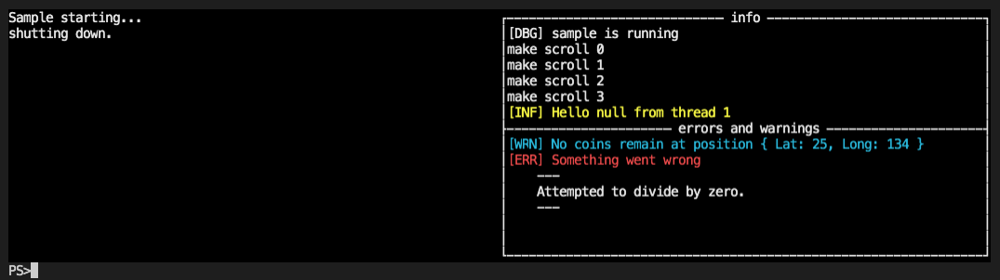

# Serilog Sink for Goblinfactory.Konsole

```csharp
    // use this extension method to register
    // a Konsole serilogger
    // see full sample at bottom of page±
    .WriteTo.KonsoleWindow(logs, errors)
```

Sample serilog sink for konsole windows.

## There's no solution file, how do I build it?

It's not meant to be "built" this is a demo project for you to copy (cut and paste) the KonsoleSink from and-or use to write your own custom Sink.

## how to run

1. git clone the project
2. `cd Sample` then `dotnet run`

dotnet run will do everything, restore packages, build and run, it's quite kool.

## How to use the Konsole Sink

```csharp

var window = new Window();
var (main, right) = window.SplitLeftRight(BorderCollapse.None);
var (logs, errors) = right.SplitTopBottom("info", "errors and warnings");

Log.Logger = new LoggerConfiguration()
    .MinimumLevel.Verbose()
    .WriteTo.KonsoleWindow(logs, errors)
    .CreateLogger();

try
{
main.WriteLine("Sample starting...");
Log.Debug("[DBG] sample is running");
for (int x = 0; x < 10; x++)
{
    Log.Debug($"make scroll {x}");
    Console.ReadKey(true);
}
Log.Information("[INF] Hello {Name} from thread {ThreadId}", Environment.GetEnvironmentVariable("USERNAME"), Thread.CurrentThread.ManagedThreadId);
Log.Warning("[WRN] No coins remain at position {@Position}", new { Lat = 25, Long = 134 });

Fail();
}
catch (Exception e)
{
Log.Error(e, "[ERR] Something went wrong");
}
finally
{
main.WriteLine("shutting down.");
}
```

Results in ... (screenshot when running on Mac OSX)


